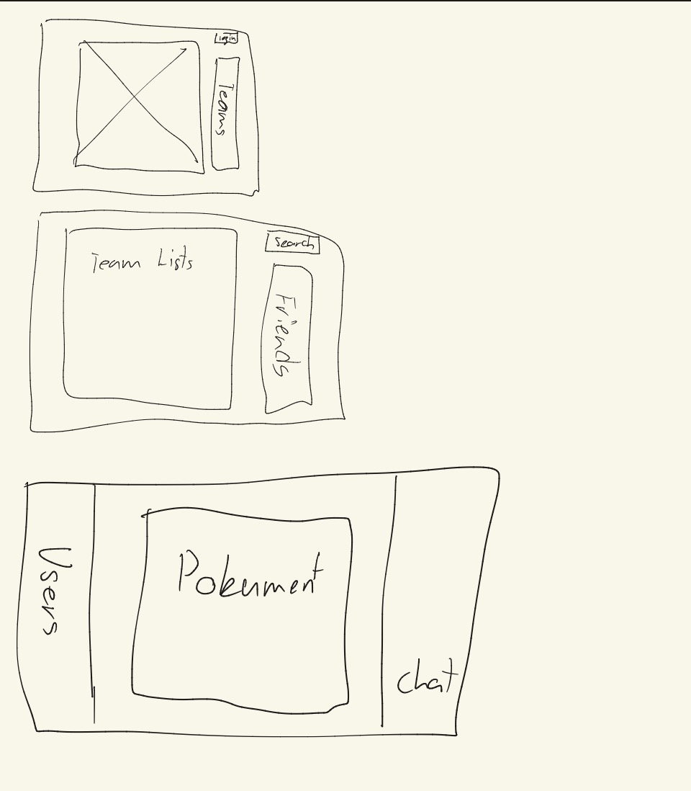

# Projekt-Dokumentation: Team Manager

---

## 1. Projektbeschreibung und Idee

> **Kriterium:** Dokumentation *(1/1 Punkt)*

Das Projekt **"Team Manager"** ist eine dedizierte Web-Applikation zur Organisation von Gaming-Gruppen und E-Sports-Teams. In der heutigen Gaming-Landschaft ist es oft unübersichtlich, Teams und Taktiken über verschiedene Plattformen hinweg zu verwalten. Diese Applikation bietet einen **zentralen Hub**: Nutzer können sich sicher einloggen, Freunde als Kontakte hinzufügen, nach passenden Teams suchen und diesen beitreten.

Das **Herzstück** bildet der teaminterne Bereich: Jedes Team verfügt über einen eigenen Text-Chat (Pinnwand-System) für die direkte Kommunikation sowie eine Dokumentenablage, in der wichtige Ressourcen (z.B. Taktik-Sheets, Map-Callouts oder Regelwerke) zentral gespeichert werden können.

### Technologie-Stack

| Komponente | Technologie               |
| ---------- | ------------------------- |
| Backend    | `Node.js` + `Express`     |
| Datenbank  | `MongoDB` (NoSQL)         |
| Frontend   | Serverseitiges Templating |

> Die Datenhaltung ermöglicht eine flexible Speicherung von Team-Rostern, Chat-Verläufen und Nutzerprofilen.

---

## 2. Kernfunktionen (CRUD-Operationen)

> **Kriterium:** Vollständigkeit der Kernfunktionen *(1/1 Punkt)*

Das Projekt deckt alle geforderten CRUD-Operationen vollständig ab. Die Entitäten sind weitreichend und stark miteinander verknüpft *(Nutzer, Teams, Chat-Nachrichten, Dokumente)*.

### Create (Erstellen)

- Registrierung eines neuen Nutzer-Accounts *(sicheres Passwort-Hashing mit `bcrypt`)*
- Gründen eines neuen Teams
- Posten einer neuen Nachricht in den Team-Chat
- Hochladen/Hinzufügen eines neuen Dokuments *(oder Ressourcen-Links)* in die Dateiablage des Teams

### Read (Lesen)

- Durchsuchen und Anzeigen einer globalen Team-Liste *(Team-Suche)*
- Anzeigen der eigenen Freundesliste
- Laden des internen Team-Dashboards *(inkl. Chat-Verlauf und angehängter Dokumente)*

### Update (Aktualisieren)

- Hinzufügen von anderen Nutzern zur eigenen Freundesliste
- Beitreten in ein bestehendes Team *(Nutzer wird in das Team-Array in MongoDB gepusht)*
- Bearbeiten von eigenen Team-Infos *(nur für Team-Admins)*

### Delete (Löschen)

- Verlassen eines Teams / Entfernen von Freunden
- Löschen von eigenen Chat-Nachrichten oder hochgeladenen Dokumenten
- Auflösen des gesamten Teams durch den Gründer

---

## 3. Benutzerfreundlichkeit & Visuelle Klarheit (UI-Konzept)

> **Kriterium:** Benutzerfreundlichkeit & Visuelle Klarheit *(1/1 Punkt)*

Die Applikation nutzt ein klares **Dashboard-Layout** (Grid-System), das stark an gängige Kommunikationstools *(wie Discord)* angelehnt ist, damit Gamer sich sofort zurechtfinden.

### Navigation (Header/Sidebar)

- Globale Suche *("Teams finden")*
- Freundesliste
- Eigenes Profil

### Team-Ansicht (Der Hauptbereich)

Wenn man ein Team anklickt, teilt sich der Bildschirm auf:

| Bereich                | Inhalt                               |
| ---------------------- | ------------------------------------ |
| **Rechte Spalte**      | Mitgliederliste *(Wer ist im Team?)* |
| **Hauptbereich Mitte** | Zwei Tabs: `Chat` und `Dokumente`    |

#### Tab 1: Chat
> Ein vertikaler Feed der letzten Nachrichten mit einem einfachen Textfeld am unteren Rand zum Senden.

#### Tab 2: Dokumente
> Eine tabellarische Auflistung aller abgelegten Dateien/Links mit Titel, Ersteller und einem Download-/Öffnen-Button.

### Klarheit & Führung

Formulare *(Registrierung, Datei-Upload)* sind minimalistisch, besitzen eindeutige Labels und geben dem Nutzer direktes Feedback bei Fehlern oder Erfolgen:

```
✓ "Team erfolgreich beigetreten!"
```

---

## 4. Technische Umsetzbarkeit & Zeitplan

> **Kriterium:** Technische Umsetzbarkeit *(1/1 Punkt)*

Trotz des großen Funktionsumfangs ist die Umsetzung innerhalb von **ca. 8 Lektionen** realistisch, da ein **Minimum Viable Product (MVP)** Ansatz verfolgt wird. Komplexe Echtzeit-Features werden geschickt vereinfacht.

### Zeitplan

| Lektion | Thema                                | Aufgaben                                                                                                                                                               |
| :-----: | ------------------------------------ | ---------------------------------------------------------------------------------------------------------------------------------------------------------------------- |
| **1-2** | Auth, Routing & Datenbank-Setup      | Setup von `Node.js`, `Express`, `Mongoose`. Implementierung von Login, Registrierung & Session-Management.                                                             |
| **3-4** | User- & Team-Logik *(Die Basis)*     | Routen für Team-Erstellung, globale Suche und Beitreten/Verlassen. Logik für das Hinzufügen von Freunden *(User-Referenzen in MongoDB)*.                               |
| **5-6** | Chat & Dokumente *(Die Interaktion)* | **Chat:** Implementierung als synchrones Pinnwand-System. *Alternative bei Zeitüberschuss: `Socket.io`*. **Dokumente:** URL-Link-Ablage oder File-Upload via `multer`. |
|  **7**  | Frontend *(Templates)*               | Erstellen der `EJS`/`Pug`-Ansichten und dynamisches Einspeisen der MongoDB-Dokumente.                                                                                  |
|  **8**  | Testing & Abschluss                  | Automatisierte Tests *(z.B. sicheres Login, Team-Beitritt)*. Finales Debugging und Abgabe.                                                                             |

---

## 5. Mockup




